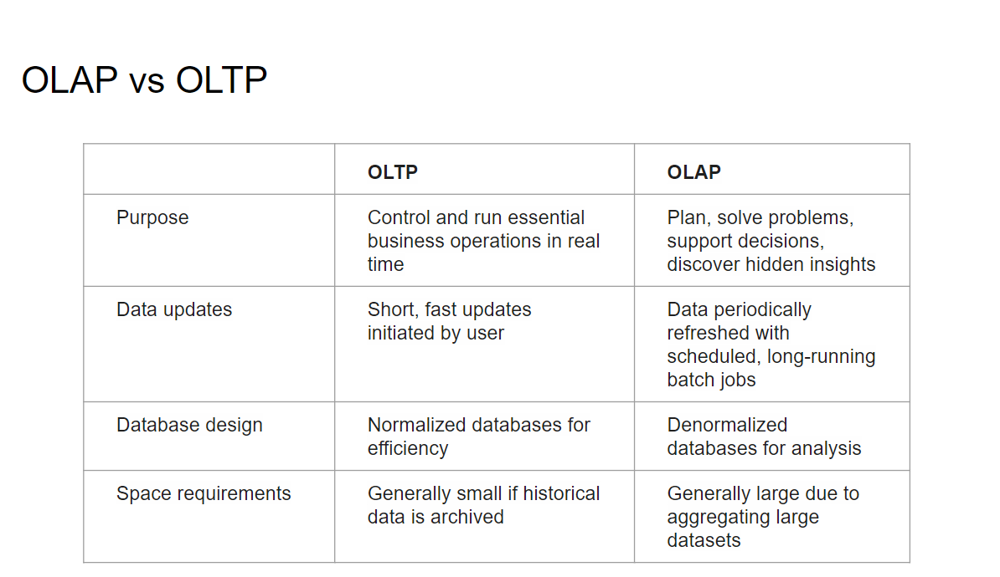
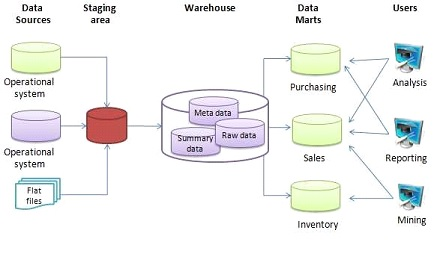
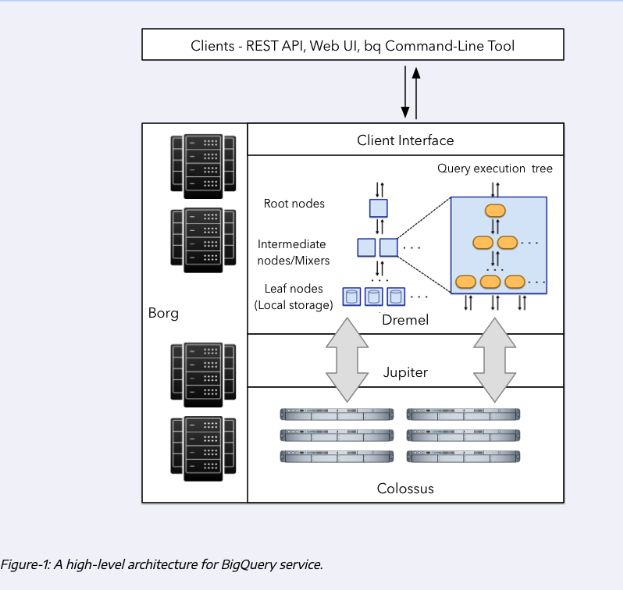

# Неделя 3
## Темы: Data Warehouse, BigQuery

## Виды баз данных OLTP и OLAP
Базы данных OLAP (базы для аналитики) имеют отличия от традиционных баз данных OLTP (базы для транзакций).  
- Данные преимущественно хранятся в колонках.
- Не предполагают частых и маленьких изменений данных.
- Данные периодически загружаются (через ETL).




## Data Warehouse
Data Warehouse - это OLAP решение, предназначенная для аналитики и создания отчетов.  
В отличии от Data Lake, Data Warehouse использует методологию ETL (Extract, Transform, Load) для загрузки данных. Обычно данные в Data Warehouse более структурированы, чем в Data Lake.   
Примеры Data Warehouse:
- Google BigQuery
- Amazon Redshift
- Snowflake
- Microsoft Azure Synapse Analytics




## Google BigQuery
BigQuery - это Data Warehouse, предоставляемый Google.  

- serverless. Нет необходимости в управлении серверами, не нужно ничего устанавливать и поддерживать.
- scalable. Масштабируется автоматически, не нужно вручную увеличивать мощность.
- high availability. Предоставляет высокую доступность, не нужно беспокоиться о сбоях.
- built-in features. Предоставляет встроенные функции, такие как Machine Learning, Geospatial Analysis и Business Intelligence.
- cost-effective. Предоставляет высокую производительность по относительно низкой цене.

## Стоимость BigQuery
BigQuery берет деньги за хранение данных и за обработку.
За обработку цена 5$ за 1 ТБ данных.
За хранение $0.02 за 1 ГБ данных в месяц.
Для организаций можно использовать flat-rate pricing, где цена фиксированная, но и ресурсы (слоты) тоже фиксируются.
Операции загрузки данных в BigQuery бесплатны (если использвоать стандартными способами).
Подробнее можно почитать [тут](https://cloud.google.com/bigquery/pricing#bigquery-pricing).

## Работа с BigQuery
Основные сущности BigQuery:
- Dataset - набор таблиц.
- Table - таблица.
- View - представление, которое позволяет создавать виртуальные таблицы на основе других таблиц.
  - Можно использовать для удобства работы с данными.
  - Можно огранить доступ к данным, дав доступ только к представлению.
  - Можно использовать Materialized View для ускорения запросов.
- External Table - таблица, которая хранится в другом месте (например, в Cloud Storage).

Также запросы в BiqQuery кешируются, что позволяет ускорять повторные запросы, и не платить за них.

## Partitioning и Clustering
Partitioning - это способ разделения данных на части.
- Позволяет ускорить запросы.
- Позволяет уменьшить объем данных, которые нужно обрабатывать.
- Не все типы данных поддерживаются для partitioning.
При создании таблицы можно указать partitioning, или потом добавить partitioning к существующей таблице.
```sql
CREATE TABLE `my_dataset.my_table` (
  `id` INT64,
  `name` STRING,
  `date` DATE
)
PARTITION BY DATE(date);
```
Clustering - это способ группировки данных в таблице.
В отличие от partitioning, clustering не разделяет данные на части, а группирует данные внутри каждой части.
```sql
CREATE TABLE `my_dataset.my_table` (
  `id` INT64,
  `name` STRING,
  `date` DATE
)
CLUSTER BY name;
```

Partitioning и Clustering можно комбинировать.

## Best practices
Cost reduction
- Avoid SELECT *
- Price your queries before running them
- Use clustered or partitioned tables
- Use streaming inserts with caution
- Materialize query results in stages

Query performance
- Filter on partitioned columns
- Denormalizing data
- Use nested or repeated columns
- Use external data sources appropriately
- Don't use it, in case u want a high query performance
- Reduce data before using a JOIN
- Do not treat WITH clauses as prepared statements
- Avoid oversharding tables

Query performance
- Avoid JavaScript user-defined functions
- Use approximate aggregation functions (HyperLogLog++)
- Order Last, for query operations to maximize performance
- Optimize your join patterns
- As a best practice, place the table with the largest number of rows first, followed by the table with the fewest rows, and then place the remaining tables by decreasing size.

## Внутреннее устройство BigQuery



Colossus - это кластер из серверов, которые хранят данные.
Dremel - это система, которая обрабатывает запросы. Разбивает их на части, которые выполняются параллельно на разных серверах.
Jupiter - это быстрая сеть, которая соединяет Colossus и Dremel.

## BigQuery ML
BigQuery ML - это инструмент для машинного обучения, который позволяет обучать модели прямо в BigQuery.

```sql
CREATE OR REPLACE MODEL `taxi-rides-ny.nytaxi.tip_hyperparam_model`
OPTIONS (
  model_type='linear_reg',
  input_label_cols=['tip_amount'],
  DATA_SPLIT_METHOD='AUTO_SPLIT',
  num_trials=5,
  max_parallel_trials=2,
  l1_reg=hparam_range(0, 20),
  l2_reg=hparam_candidates([0, 0.1, 1, 10])
) AS
SELECT
*
FROM
`taxi-rides-ny.nytaxi.yellow_tripdata_ml`
WHERE
tip_amount IS NOT NULL;
```

```sql
SELECT
  *
FROM
ML.EVALUATE(
  MODEL `taxi-rides-ny.nytaxi.tip_model`, (
    SELECT
      *
    FROM
      `taxi-rides-ny.nytaxi.yellow_tripdata_ml`
    WHERE
      tip_amount IS NOT NULL
  )
);
```

```sql
SELECT
  *
FROM
ML.PREDICT(
  MODEL `taxi-rides-ny.nytaxi.tip_model`, (
    SELECT
      *
    FROM
      `taxi-rides-ny.nytaxi.yellow_tripdata_ml`
    WHERE
      tip_amount IS NOT NULL
  )
);

```

## Как подключиться к BigQuery
- Использовать консольный клиент bq.
- Использовать BiqQuery Web UI.
- Использовать коннекторы из разных языков программирования.
- Использовать Data Studio.


## Ссылки

- https://github.com/ziritrion/dataeng-zoomcamp/blob/main/notes/3_data_warehouse.md
- https://docs.google.com/presentation/d/1a3ZoBAXFk8-EhUsd7rAZd-5p_HpltkzSeujjRGB2TAI/edit#slide=id.g10eebc44ce4_0_0
- https://github.com/DataTalksClub/data-engineering-zoomcamp/tree/main/week_3_data_warehouse


