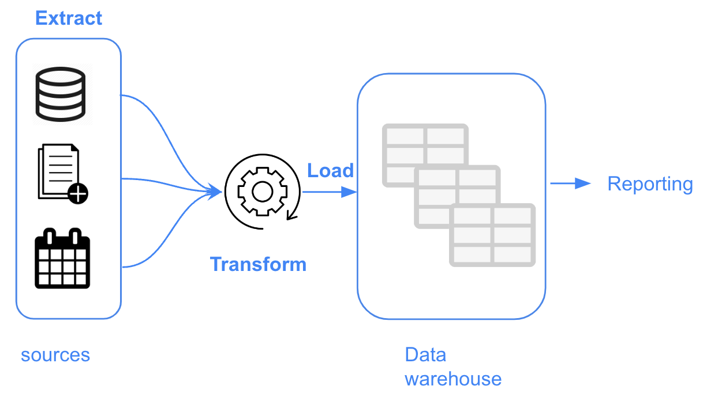
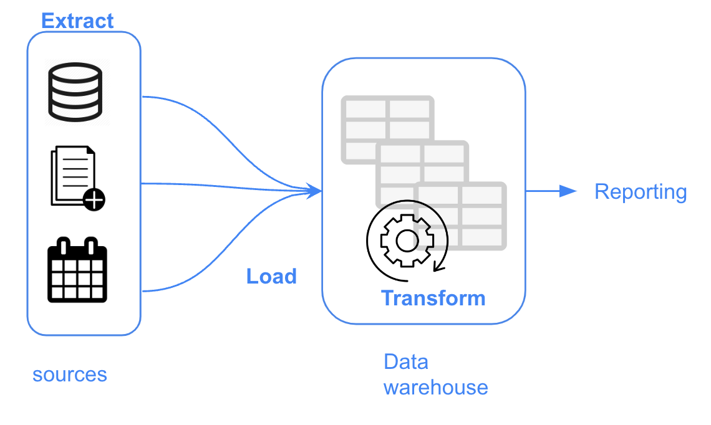
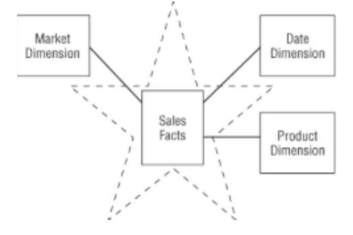
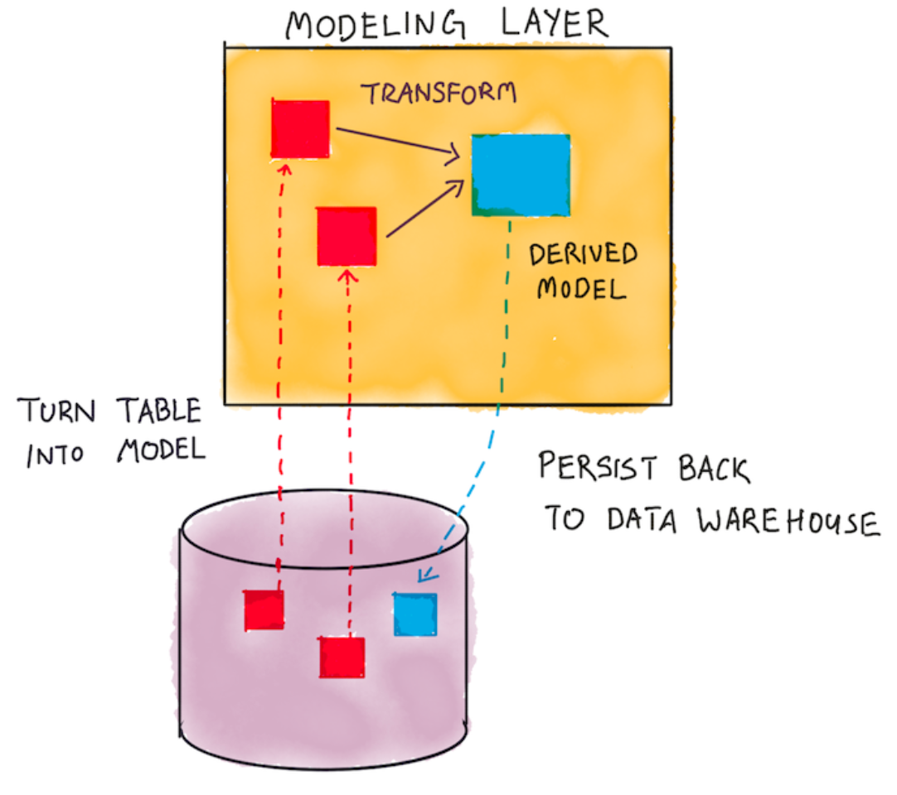
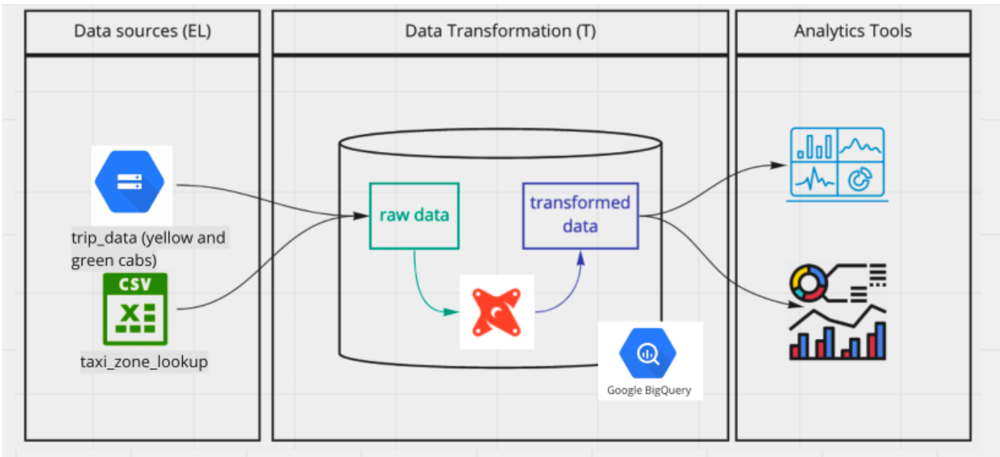
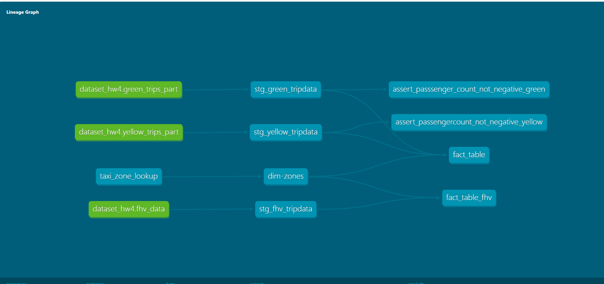
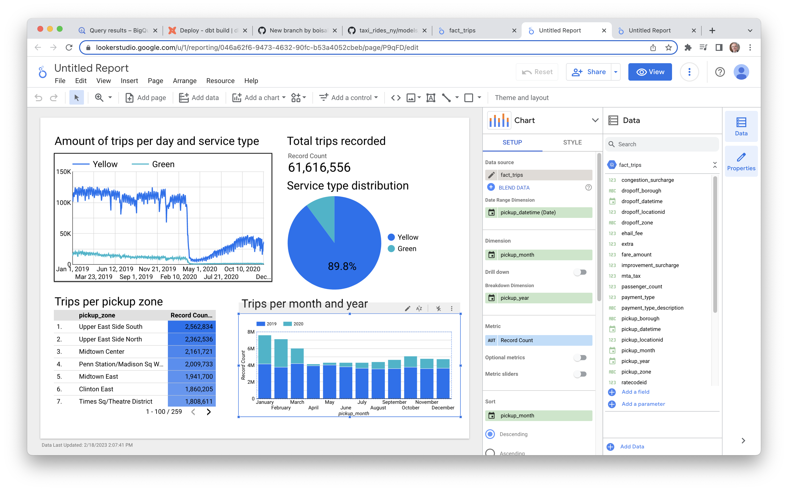

# Неделя 4
## Темы: Analytic engineering, dbt

### Analytic engineering
Это роль на стыке Data Engineering и Business Analytic. Основная задача - создание и поддержка инфраструктуры для аналитиков.  
Должны хорошо разбираться в аналитике, тесно работать с аналитиками, понимать их потребности и помогать им решать их задачи.  
С другой стороны, должны хорошо разбираться в data инфраструктуре, чтобы понимать, откуда данные берутся, и как их обрабатывать.  

Получается, что Analytic Engineer - готовит готовые данные для BI, DS, ML.

### Переход от ETL к ELT
ETL - Extract, Transform, Load.  
ELT - Extract, Load, Transform.  

 

С развитием Big Data и Data Warehouse, ETL стало менее эффективным. Процесс обработки данных стал дорогим, и часто необходимо обрабатывать большие объемы данных.  
Между тем стоимость хранения данных стала снижаться и стало возможным все чаще переходить на другую модель - ELT.  

Через коннекторы мы делаем сначала EL шаг, загружаем сырые данные в хранилище. И уже потом делаем фазу T - обрабатываем их внутри хранилища
Примеры коннекторов:
 - fivetran
 - meltano
 - matillion
 - airbyte
 - самописные решения

Оказалось, что у этого решения есть определенные преимущества:
 - данные загружаются быстрее
 - мы можем работать с сырыми данными (бывает полезно для data science)
 - мы можем обрабатывать данные внутри хранилища, что позволяет делать более сложные преобразования

### data modeling
Data modeling - это процесс создания моделей данных, которые будут использоваться для аналитики.  
Модели описывают данные, их структуру, связи между ними, и т.д.  
Модели могут быть различными, например, star schema, snowflake schema, модель Кимбелла, и т.д.  
В основе лежит таблица фактов, и таблицы измерений, которые описывают различные аспекты фактов.  



### dbt
dbt - это инструмент для преобразования данных внутри хранилища. Это open source инструмент, который позволяет писать SQL код, который будет выполняться внутри хранилища.   
Он использует концепцию моделей, которые описывают данные.   
TLDR: Одни таблицы выступают в качестве источника данных, и мы через SQL запросы описываем преобразования этих данных, получая в итоге результирующие таблицы, которые будут использоватся аналитиками.  






### Cloud и CLI
Можно использовать cloud версию. Но в ней ограничение только на 1 пользователя и 1 проект в бесплатной версии.  
Можно использовать CLI версию, которая устанавливается локально.

Принцип работы одинаковые, нужно настроить подключение к своему хранилищу, и при запуске команд dbt - выполняются определенные скрипты в нем.
В cloud версии есть возможность деплой - возможность запуска команд по расписанию, и на другом environment.
В cli версии это нужно сделать самому через cron или подобные инструменты.

Пример проекта dbt можно посмотреть в [моей домашней работе](../../week4_dbt/dbt)

### dbt: модели
Модели описываются в файлах .sql, которые находятся в папке models.  
Дополнительно через файлы .yml можно описывать метаданные моделей, например, описание, теги, источники данных.

Пример модели:
```sql
{{ config(
    materialized='table',
    description='This is a description of the model',
    tags=['example', 'example2']
) }}
select locationid, borough, zone, replace(service_zone, 'Boro', 'Green') as service_zone
from {{ ref("taxi_zone_lookup") }}
```

Пример файла .yml:
```yml
version: 2

models:
  - name: taxi_zone_lookup
    description: "This is a description of the model"
    columns:
      - name: locationid
        description: "This is a description of the column"
        tests:
          - unique
          - not_null
```

Мы используем конструкцию {{ ref("taxi_zone_lookup") }} для того, чтобы указать, что мы хотим использовать данные из другой модели. С ее помощью мы можем описывать зависимости между моделями и построить DAG.


### dbt: sources

Sources - это источники данных, откуда мы берем данные для моделей.
Мы можем жестко указать источник данных внутри модели, но это не очень удобно, если мы хотим переиспользовать модель в разных проектах.
Для этого мы можем описать источники данных в файле sources.yml, и потом использовать их в моделях.
Наприер, вот так мы можем описать источник данных:
```yml
version: 2

sources:
  - name: dataset_hw4
    database: summer-flux-373415

    tables:
      - name: green_trips_part
      - name: yellow_trips_part
      - name: fhv_data
```

### dbt: seeds
Seeds - это обычно небольшие таблицы, которые мы загружаем из csv файлов. 
Ложим их в папку seeds и можем использовать в моделях через конструкцию {{ ref("seed_name") }}

### dbt: tests
Dbt известен еще тем, что позвоняет указывать тесты для моделей.
Тесты бывают generic - в коробке их 4, можно добавить свои.  
Они настраиваются в yml файле, и относятся к конкретной колонке.
Например:
- unique
- not_null
- accepted_values
- relationships

Также можно писать свои тесты, например, проверять, что в колонке нет пустых значений, или что в колонке есть только числа.  
Для этого пишем sql запрос, который возращает какие-то строки, если тест не пройден.  
Кладем этот скрипт в папку tests.  
Чтобы тест относился к какой-то модели, нужно использовать ее через конструкцию {{ ref("model_name") }}

### dbt: документация

На основании описания данных dbt автоматически генерирует документацию.

Через команду `dbt docs serve` можно запустить локальный сервер, на котором можно посмотреть документацию. В клоуд версии это тоже есть - отдельная кнопка.

Также в документации можно посмотреть полный DAG, который строится на основании зависимостей между моделями.



### dbt: команды

- dbt run - запускает все модели (запускает скрипты в базе )
- dbt compile - компилирует модели, и кладет их в папку target (вместо макросов делает рабочий SQL)
- dbt test - запускает тесты
- dbt docs generate - генерирует документацию
- dbt docs serve - запускает локальный сервер с документацией
- dbt seed - загружает данные из csv файлов в таблицы в базе
- dbt deps - устанавливает зависимости
- dbt build - dbt run + dbt test (но если какой-то тест упадет, то дальше не будет выполняться)

### dbt: packages

Dbt позволяет использовать готовые пакеты, которые можно найти в [hub](https://hub.getdbt.com/).
Для добавления в проект нужно добавить в файл packages.yml и запустить `dbt deps`:
```yml
packages:
  - package: dbt-labs/dbt_utils
    version: 0.8.0
```


## Google Looker

Также немного пораобтали с Google Looker. Из итоговой таблицы в BigQuery, сделали дашборд в Looker.




