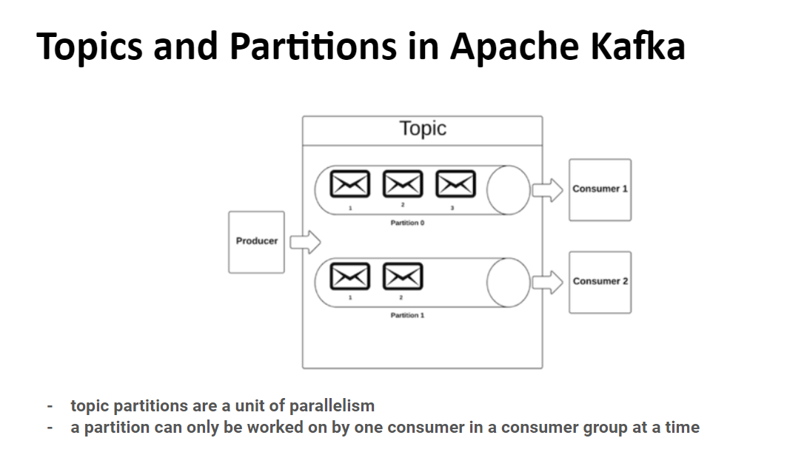

# Неделя 6
## Темы: Stream processing, Kafka

### Что такое Stream processing

Зачастую нам нужно делать системы, которые должны работать в режиме реального времени. К примеру биржевой робот, который реагирует на текущие цены акций. Или система, которая анализирует поток данных с датчиков. В таких системах нам нужно обрабатывать данные в режиме реального времени, а не в режиме batch. Для этого существует такая технология как Stream processing.  

В Stream processing мы не оперируем большим набором данным, а лишь небольшими порциями + некоторые агрегации. Таким образом мы можем обрабатывать данные в режиме реального времени.  

### Что такое Kafka

Kafka это брокер сообщений, написанный на Java. Он позволяет нам отправлять сообщения в топики и читать их из топиков.  
Вообще по определению - это распределенный журнал логов. Она может очень хорошо масштабироваться горизонтально, и имеет очень хорошую отказоустойчивость.

По способу работы, она похожа на брокер сообщений, есть producer и consumer. Но есть отличия.  

О ее принципе можно сказать фразой "**умные клиенты, тупая очередь**", и за счет ее простоты и достигается высокая производительность и масштабируемость.  
Она не остлеживает статусы сообщения, не уведомляет получателей о доставке сообщения, просто записывает сообщение на диск в определенную партицию, а producer когда обращается к брокеру, спрашивает если сообщения после определенного offset и получает их если есть (offset сдвигается).  
Клиенты сами собирают данные обо всех нодах кластера, и сами решают куда отправлять сообщения (партиция определяется по hash от message key).  
Плюс сообщения после доставки не исчезают, а хранятся в течении определенного времени (вплоть до бесконечности), это задается настройкой retention.

### Термины Kafka

- Топик - это как канал, в который мы можем отправлять и из которого можем читать сообщения.  
- Партиция - это логическая единица, в которой хранятся сообщения топика. Партиции распределяются по нодам кластера.  
- Сообщение - это набор байтов, которые мы отправляем в топик.
- Message key - это ключ сообщения, который мы можем использовать для определения партиции, в которую будет записано сообщение.
- Offset - это номер сообщения в партиции.
- Реплика - это копия партиции, которая расположена на другой ноде кластера, и которая используется для обеспечения отказоустойчивости.
- Leader - это нода, которая отвечает за чтение и запись в партицию.
- Follower - это нода, которая отвечает за чтение из партиции.

### Архитектура Kafka

Топик - это логическая единица, в которой хранятся сообщения. Когда мы создаем топик, мы можем указать количество партиций, которые будут созданы для этого топика, а также уровень репликации.

Партиция - это физическая единица, в которой хранятся сообщения. Каждая партиция хранится на одной ноде кластера. Партиции распределяются по нодам кластера по алгоритму от message key.  
Т.к. сообщения с одним message key всегда попадают в одну и ту же партицию, то мы можем гарантировать, что сообщения с одним message key будут записаны в одну и ту же партицию, и будут прочитаны в том же порядке, в котором они были записаны.  




### Репликация
Для каждой партиции есть один лидер - нода которая является основной, и в которую записываются новые данные, и followers - ноды, которые являются репликами, и которые используются для обеспечения отказоустойчивости.


### Настройки Kafka

Некоторые настройки, которые позволяют настраивать топики, consumer и producer.


### Запуск Kafka в Docker

Пример докер файла, который мы использовали в курсе. В нем мы создаем сеть, в которой будут запущены все наши сервисы, и запускаем zookeeper и kafka брокер + несколько других сервисов, которые нам понадобятся.
```dockerfile
version: '3.6'
networks:
  default:
    name: kafka-spark-network
    external: true
services:
  broker:
    image: confluentinc/cp-kafka:7.2.0
    hostname: broker
    container_name: broker
    depends_on:
      - zookeeper
    ports:
      - '9092:9092'
    environment:
      KAFKA_BROKER_ID: 1
      KAFKA_ZOOKEEPER_CONNECT: 'zookeeper:2181'
      KAFKA_LISTENER_SECURITY_PROTOCOL_MAP: PLAINTEXT:PLAINTEXT,PLAINTEXT_HOST:PLAINTEXT
      KAFKA_LISTENERS: PLAINTEXT://broker:29092,PLAINTEXT_HOST://broker:9092
      KAFKA_ADVERTISED_LISTENERS: PLAINTEXT://broker:29092,PLAINTEXT_HOST://localhost:9092
      KAFKA_INTER_BROKER_LISTENER_NAME: PLAINTEXT
      KAFKA_OFFSETS_TOPIC_REPLICATION_FACTOR: 1
      KAFKA_GROUP_INITIAL_REBALANCE_DELAY_MS: 0
      KAFKA_TRANSACTION_STATE_LOG_MIN_ISR: 1
      KAFKA_TRANSACTION_STATE_LOG_REPLICATION_FACTOR: 1
  schema-registry:
    image: confluentinc/cp-schema-registry:7.2.0
    hostname: schema-registry
    container_name: schema-registry
    depends_on:
      - zookeeper
      - broker
    ports:
      - "8081:8081"
    environment:
      # SCHEMA_REGISTRY_KAFKASTORE_CONNECTION_URL: "zookeeper:2181" #(depreciated)
      SCHEMA_REGISTRY_KAFKASTORE_BOOTSTRAP_SERVERS: "broker:29092"
      SCHEMA_REGISTRY_HOST_NAME: "localhost"
      SCHEMA_REGISTRY_LISTENERS: "http://0.0.0.0:8081" #(default: http://0.0.0.0:8081)
  zookeeper:
    image: confluentinc/cp-zookeeper:7.2.0
    hostname: zookeeper
    container_name: zookeeper
    ports:
      - '2181:2181'
    environment:
      ZOOKEEPER_CLIENT_PORT: 2181
      ZOOKEEPER_TICK_TIME: 2000
  control-center:
    image: confluentinc/cp-enterprise-control-center:7.2.0
    hostname: control-center
    container_name: control-center
    depends_on:
      - zookeeper
      - broker
      - schema-registry
    ports:
      - "9021:9021"
    environment:
      CONTROL_CENTER_BOOTSTRAP_SERVERS: 'broker:29092'
      CONTROL_CENTER_ZOOKEEPER_CONNECT: 'zookeeper:2181'
      CONTROL_CENTER_SCHEMA_REGISTRY_URL: "http://localhost:8081"
      CONTROL_CENTER_REPLICATION_FACTOR: 1
      CONTROL_CENTER_INTERNAL_TOPICS_PARTITIONS: 1
      CONTROL_CENTER_MONITORING_INTERCEPTOR_TOPIC_PARTITIONS: 1
      CONFLUENT_METRICS_TOPIC_REPLICATION: 1
      PORT: 9021

  kafka-rest:
    image: confluentinc/cp-kafka-rest:7.2.0
    hostname: kafka-rest
    ports:
      - "8082:8082"
    depends_on:
      - schema-registry
      - broker
    environment:
      KAFKA_REST_BOOTSTRAP_SERVERS: 'broker:29092'
      KAFKA_REST_ZOOKEEPER_CONNECT: 'zookeeper:2181'
      KAFKA_REST_SCHEMA_REGISTRY_URL: 'http://localhost:8081'
      KAFKA_REST_HOST_NAME: localhost
      KAFKA_REST_LISTENERS: 'http://0.0.0.0:8082'
```

Еще одна версия как запустить кафку:
```bash
docker run -d --network=kafkanet --name=zookeeper -e ZOOKEEPER_CLIENT_PORT=2181 -e ZOOKEEPER_TICK_TIME=2000 -p 2181:2181 confluentinc/cp-zookeeper

docker run -d --network=kafkanet --name=kafka -e KAFKA_ZOOKEEPER_CONNECT=zookeeper:2181 -e KAFKA_ADVERTISED_LISTENERS=PLAINTEXT://localhost:9092 -e KAFKA_OFFSETS_TOPIC_REPLICATION_FACTOR=1 -p 9092:9092 confluentinc/cp-kafka

# Проверяем что все работает
docker exec -it kafka bash
/bin/kafka-topics --create --topic demo-topic --bootstrap-server kafka:9092
/bin/kafka-topics --list --zookeeper zookeeper:2181
/bin/kafka-topics --describe --topic demo-topic --bootstrap-server kafka:9092
/bin/kafka-console-producer --topic demo-topic --bootstrap-server kafka:9092
/bin/kafka-console-consumer --topic demo-topic --from-beginning --bootstrap-server kafka:9092

```


С версии 1.0.0 Kafka поддерживает [KRaft](https://developer.confluent.io/learn/kraft/) - режим работы без Zookeeper, но на реальных проектах его пока не стоит использовать, так как он еще не стабилен.  


При создании кластера Kafka - вам нужно иметь не менее 3 брокеров, а также хорошую сеть, чтобы обеспечить отказоустойчивость.

### Confluent cloud

Также есть возможность использовать [Confluent cloud](https://www.confluent.io/confluent-cloud/), который представляет собой managed Kafka, со многочисленными удобными функциями. В нем есть пробный период с определенным количеством кредитов, можно для изучения попробовать его. 
Konfluent это основной разработчик Kafka. 

### Простой producer на java

```java
public class JsonProducer {
    private Properties props = new Properties();
    public JsonProducer() {
        props.put(StreamsConfig.BOOTSTRAP_SERVERS_CONFIG, "pkc-75m1o.europe-west3.gcp.confluent.cloud:9092");
        props.put("security.protocol", "SASL_SSL");
        props.put("sasl.jaas.config", "org.apache.kafka.common.security.plain.PlainLoginModule required username='"+Secrets.KAFKA_CLUSTER_KEY+"' password='"+Secrets.KAFKA_CLUSTER_SECRET+"';");
        props.put("sasl.mechanism", "PLAIN");
        props.put("client.dns.lookup", "use_all_dns_ips");
        props.put("session.timeout.ms", "45000");
        props.put(ProducerConfig.ACKS_CONFIG, "all");
        props.put(ProducerConfig.KEY_SERIALIZER_CLASS_CONFIG, "org.apache.kafka.common.serialization.StringSerializer");
        props.put(ProducerConfig.VALUE_SERIALIZER_CLASS_CONFIG, "io.confluent.kafka.serializers.KafkaJsonSerializer");
    }

    public List<Ride> getRides() throws IOException, CsvException {
        var ridesStream = this.getClass().getResource("/rides.csv");
        var reader = new CSVReader(new FileReader(ridesStream.getFile()));
        reader.skip(1);
        return reader.readAll().stream().map(arr -> new Ride(arr))
                .collect(Collectors.toList());

    }

    public void publishRides(List<Ride> rides) throws ExecutionException, InterruptedException {
        KafkaProducer<String, Ride> kafkaProducer = new KafkaProducer<String, Ride>(props);
        for(Ride ride: rides) {
            ride.tpep_pickup_datetime = LocalDateTime.now().minusMinutes(20);
            ride.tpep_dropoff_datetime = LocalDateTime.now();
            var record = kafkaProducer.send(new ProducerRecord<>("rides", String.valueOf(ride.DOLocationID), ride), (metadata, exception) -> {
                if(exception != null) {
                    System.out.println(exception.getMessage());
                }
            });
            System.out.println(record.get().offset());
            System.out.println(ride.DOLocationID);
            Thread.sleep(500);
        }
    }

    public static void main(String[] args) throws IOException, CsvException, ExecutionException, InterruptedException {
        var producer = new JsonProducer();
        var rides = producer.getRides();
        producer.publishRides(rides);
    }
}
```

### Простой consumer на java

```java
public class JsonConsumer {

    private Properties props = new Properties();
    private KafkaConsumer<String, Ride> consumer;
    public JsonConsumer() {
        props.put(ConsumerConfig.BOOTSTRAP_SERVERS_CONFIG, "pkc-75m1o.europe-west3.gcp.confluent.cloud:9092");
        props.put("security.protocol", "SASL_SSL");
        props.put("sasl.jaas.config", "org.apache.kafka.common.security.plain.PlainLoginModule required username='"+Secrets.KAFKA_CLUSTER_KEY+"' password='"+Secrets.KAFKA_CLUSTER_SECRET+"';");
        props.put("sasl.mechanism", "PLAIN");
        props.put("client.dns.lookup", "use_all_dns_ips");
        props.put("session.timeout.ms", "45000");
        props.put(ConsumerConfig.KEY_DESERIALIZER_CLASS_CONFIG, "org.apache.kafka.common.serialization.StringDeserializer");
        props.put(ConsumerConfig.VALUE_DESERIALIZER_CLASS_CONFIG, "io.confluent.kafka.serializers.KafkaJsonDeserializer");
        props.put(ConsumerConfig.GROUP_ID_CONFIG, "kafka_tutorial_example.jsonconsumer.v2");
        props.put(ConsumerConfig.AUTO_OFFSET_RESET_CONFIG, "earliest");
        props.put(KafkaJsonDeserializerConfig.JSON_VALUE_TYPE, Ride.class);
        consumer = new KafkaConsumer<String, Ride>(props);
        consumer.subscribe(List.of("rides"));

    }

    public void consumeFromKafka() {
        System.out.println("Consuming form kafka started");
        var results = consumer.poll(Duration.of(1, ChronoUnit.SECONDS));
        var i = 0;
        do {

            for(ConsumerRecord<String, Ride> result: results) {
                System.out.println(result.value().DOLocationID);
            }
            results =  consumer.poll(Duration.of(1, ChronoUnit.SECONDS));
            System.out.println("RESULTS:::" + results.count());
            i++;
        }
        while(!results.isEmpty() || i < 10);
    }

    public static void main(String[] args) {
        JsonConsumer jsonConsumer = new JsonConsumer();
        jsonConsumer.consumeFromKafka();
    }
}
```

### Kafka Streams
Позволяет делать обработку потоков данных. Для этого используется State. Т.е. можно хранить данные в специльаных топиках, которые аггрегируют сообщения, к примеру подсчет сообщений по message key.  
Для этого под капотом создаются специальные служебные топики, которые хранят состояние. Kafka Streams пишется на java.

Важно иметь одинаковый message key, чтобы сообщения попадали в один и тот же партишен.  

Поддерживается аггрегация сообщений (в т.ч. по времени), join, и прочее.

Stream создается как топология обработки данных, а потом запускается.

```java

public class JsonKStream {
    private Properties props = new Properties();

    public JsonKStream() {
        props.put(StreamsConfig.BOOTSTRAP_SERVERS_CONFIG, "pkc-75m1o.europe-west3.gcp.confluent.cloud:9092");
        props.put("security.protocol", "SASL_SSL");
        props.put("sasl.jaas.config", "org.apache.kafka.common.security.plain.PlainLoginModule required username='"+Secrets.KAFKA_CLUSTER_KEY+"' password='"+Secrets.KAFKA_CLUSTER_SECRET+"';");
        props.put("sasl.mechanism", "PLAIN");
        props.put("client.dns.lookup", "use_all_dns_ips");
        props.put("session.timeout.ms", "45000");
        props.put(StreamsConfig.APPLICATION_ID_CONFIG, "kafka_tutorial.kstream.count.plocation.v1");
        props.put(ConsumerConfig.AUTO_OFFSET_RESET_CONFIG, "latest");
        props.put(StreamsConfig.CACHE_MAX_BYTES_BUFFERING_CONFIG, 0);

    }

    public Topology createTopology() {
        StreamsBuilder streamsBuilder = new StreamsBuilder();
        var ridesStream = streamsBuilder.stream("rides", Consumed.with(Serdes.String(), CustomSerdes.getSerde(Ride.class)));
        var puLocationCount = ridesStream.groupByKey().count().toStream();
        puLocationCount.to("rides-pulocation-count", Produced.with(Serdes.String(), Serdes.Long()));
        return streamsBuilder.build();
    }

    public void countPLocation() throws InterruptedException {
        var topology = createTopology();
        var kStreams = new KafkaStreams(topology, props);
        kStreams.start();
        while (kStreams.state() != KafkaStreams.State.RUNNING) {
            System.out.println(kStreams.state());
            Thread.sleep(1000);
        }
        System.out.println(kStreams.state());
        Runtime.getRuntime().addShutdownHook(new Thread(kStreams::close));
    }

    public static void main(String[] args) throws InterruptedException {
        var object = new JsonKStream();
        object.countPLocation();
    }
}
```

Пример с join двух потоков

```java
public class JsonKStreamJoins {
    private Properties props = new Properties();

    public JsonKStreamJoins() {
        props.put(StreamsConfig.BOOTSTRAP_SERVERS_CONFIG, "pkc-75m1o.europe-west3.gcp.confluent.cloud:9092");
        props.put("security.protocol", "SASL_SSL");
        props.put("sasl.jaas.config", "org.apache.kafka.common.security.plain.PlainLoginModule required username='"+Secrets.KAFKA_CLUSTER_KEY+"' password='"+Secrets.KAFKA_CLUSTER_SECRET+"';");
        props.put("sasl.mechanism", "PLAIN");
        props.put("client.dns.lookup", "use_all_dns_ips");
        props.put("session.timeout.ms", "45000");
        props.put(StreamsConfig.APPLICATION_ID_CONFIG, "kafka_tutorial.kstream.joined.rides.pickuplocation.v1");
        props.put(ConsumerConfig.AUTO_OFFSET_RESET_CONFIG, "latest");
        props.put(StreamsConfig.CACHE_MAX_BYTES_BUFFERING_CONFIG, 0);
    }

    public Topology createTopology() {
        StreamsBuilder streamsBuilder = new StreamsBuilder();
        KStream<String, Ride> rides = streamsBuilder.stream(Topics.INPUT_RIDE_TOPIC, Consumed.with(Serdes.String(), CustomSerdes.getSerde(Ride.class)));
        KStream<String, PickupLocation> pickupLocations = streamsBuilder.stream(Topics.INPUT_RIDE_LOCATION_TOPIC, Consumed.with(Serdes.String(), CustomSerdes.getSerde(PickupLocation.class)));

        var pickupLocationsKeyedOnPUId = pickupLocations.selectKey((key, value) -> String.valueOf(value.PULocationID));

        var joined = rides.join(pickupLocationsKeyedOnPUId, (ValueJoiner<Ride, PickupLocation, Optional<VendorInfo>>) (ride, pickupLocation) -> {
                    var period = Duration.between(ride.tpep_dropoff_datetime, pickupLocation.tpep_pickup_datetime);
                    if (period.abs().toMinutes() > 10) return Optional.empty();
                    else return Optional.of(new VendorInfo(ride.VendorID, pickupLocation.PULocationID, pickupLocation.tpep_pickup_datetime, ride.tpep_dropoff_datetime));
                }, JoinWindows.ofTimeDifferenceAndGrace(Duration.ofMinutes(20), Duration.ofMinutes(5)),
                StreamJoined.with(Serdes.String(), CustomSerdes.getSerde(Ride.class), CustomSerdes.getSerde(PickupLocation.class)));

        joined.filter(((key, value) -> value.isPresent())).mapValues(Optional::get)
                .to(Topics.OUTPUT_TOPIC, Produced.with(Serdes.String(), CustomSerdes.getSerde(VendorInfo.class)));

        return streamsBuilder.build();
    }

    public void joinRidesPickupLocation() throws InterruptedException {
        var topology = createTopology();
        var kStreams = new KafkaStreams(topology, props);

        kStreams.setUncaughtExceptionHandler(exception -> {
            System.out.println(exception.getMessage());
            return StreamsUncaughtExceptionHandler.StreamThreadExceptionResponse.SHUTDOWN_APPLICATION;
        });
        kStreams.start();
        while (kStreams.state() != KafkaStreams.State.RUNNING) {
            System.out.println(kStreams.state());
            Thread.sleep(1000);
        }
        System.out.println(kStreams.state());
        Runtime.getRuntime().addShutdownHook(new Thread(kStreams::close));

    }

    public static void main(String[] args) throws InterruptedException {
        var object = new JsonKStreamJoins();
        object.joinRidesPickupLocation();
    }
}
```


### Kafka SQL
Это специльный сервис, который позволяет обрабатывать данные в Kafka через SQL запросы. Это не база данных, это также остается потоком.

Это похоже на Kafka Stream, только вы пишите SQL запросы, а не код на Java.

Например можно запустить такой запрос, и он запустить поток, которые будет выдавать новые строчки когда они появятся в базе:

```sql
// Создаем таблицу из топика
CREATE STREAM ride_streams (
    VendorId varchar, 
    trip_distance double,
    payment_type varchar
)  WITH (KAFKA_TOPIC='rides',
        VALUE_FORMAT='JSON');

// Читаем сообщения из топика
select * from RIDE_STREAMS 
EMIT CHANGES;

// Количество сообщений в топике
SELECT VENDORID, count(*) FROM RIDE_STREAMS 
GROUP BY VENDORID
EMIT CHANGES;

// Более сложный пример
SELECT payment_type, count(*) FROM RIDE_STREAMS 
WHERE payment_type IN ('1', '2')
GROUP BY payment_type
EMIT CHANGES;

// Window функции
CREATE TABLE payment_type_sessions AS
  SELECT payment_type,
         count(*)
  FROM  RIDE_STREAMS 
  WINDOW SESSION (60 SECONDS)
  GROUP BY payment_type
  EMIT CHANGES;
```

### Kafka Connect
Для Kafka существует множество уже готовых коннекторов. Например для работы с базами данных, для работы с файловой системой, для работы с S3 и т.д.

Например, есть Debezium, он позволяет отлеживать изменения в базе данных и отправлять сообщения в топики Kafka/


Есть конекторы двух видом - Source и Sink. Source коннекторы читают данные из внешнего источника и отправляют их в Kafka. Sink коннекторы читают данные из Kafka и отправляют их во внешний источник.

Какие есть коннекторы:


### Использование Kafka в python
Для python есть несколько библиотек по работе с Kafka:
* kafka
* faust
* fastkafka 

Несколько примеров использования Kafka в python

Producer
```python

import csv
import json
from typing import List, Dict
from kafka import KafkaProducer
from kafka.errors import KafkaTimeoutError

from ride import Ride
from settings import BOOTSTRAP_SERVERS, INPUT_DATA_PATH, KAFKA_TOPIC


class JsonProducer(KafkaProducer):
    def __init__(self, props: Dict):
        self.producer = KafkaProducer(**props)

    @staticmethod
    def read_records(resource_path: str):
        records = []
        with open(resource_path, 'r') as f:
            reader = csv.reader(f)
            header = next(reader)  # skip the header row
            for row in reader:
                records.append(Ride(arr=row))
        return records

    def publish_rides(self, topic: str, messages: List[Ride]):
        for ride in messages:
            try:
                record = self.producer.send(topic=topic, key=ride.pu_location_id, value=ride)
                print('Record {} successfully produced at offset {}'.format(ride.pu_location_id, record.get().offset))
            except KafkaTimeoutError as e:
                print(e.__str__())


if __name__ == '__main__':
    # Config Should match with the KafkaProducer expectation
    config = {
        'bootstrap_servers': BOOTSTRAP_SERVERS,
        'key_serializer': lambda key: str(key).encode(),
        'value_serializer': lambda x: json.dumps(x.__dict__, default=str).encode('utf-8')
    }
    producer = JsonProducer(props=config)
    rides = producer.read_records(resource_path=INPUT_DATA_PATH)
    producer.publish_rides(topic=KAFKA_TOPIC, messages=rides)
```

Consumer 
```python
from typing import Dict, List
from json import loads
from kafka import KafkaConsumer

from ride import Ride
from settings import BOOTSTRAP_SERVERS, KAFKA_TOPIC


class JsonConsumer:
    def __init__(self, props: Dict):
        self.consumer = KafkaConsumer(**props)

    def consume_from_kafka(self, topics: List[str]):
        self.consumer.subscribe(topics)
        print('Consuming from Kafka started')
        print('Available topics to consume: ', self.consumer.subscription())
        while True:
            try:
                # SIGINT can't be handled when polling, limit timeout to 1 second.
                message = self.consumer.poll(1.0)
                if message is None or message == {}:
                    continue
                for message_key, message_value in message.items():
                    for msg_val in message_value:
                        print(msg_val.key, msg_val.value)
            except KeyboardInterrupt:
                break

        self.consumer.close()


if __name__ == '__main__':
    config = {
        'bootstrap_servers': BOOTSTRAP_SERVERS,
        'auto_offset_reset': 'earliest',
        'enable_auto_commit': True,
        'key_deserializer': lambda key: int(key.decode('utf-8')),
        'value_deserializer': lambda x: loads(x.decode('utf-8'), object_hook=lambda d: Ride.from_dict(d)),
        'group_id': 'consumer.group.id.json-example.1',
    }

    json_consumer = JsonConsumer(props=config)
    json_consumer.consume_from_kafka(topics=[KAFKA_TOPIC])
```

Consumer faust

```python
import faust
from taxi_rides import TaxiRide


app = faust.App('datatalksclub.stream.v2', broker='kafka://localhost:9092')
topic = app.topic('datatalkclub.yellow_taxi_ride.json', value_type=TaxiRide)


@app.agent(topic)
async def start_reading(records):
    async for record in records:
        print(record)


if __name__ == '__main__':
    app.main()
```

Использование Streams:
```python
from datetime import timedelta
import faust
from taxi_rides import TaxiRide


app = faust.App('datatalksclub.stream.v2', broker='kafka://localhost:9092')
topic = app.topic('datatalkclub.yellow_taxi_ride.json', value_type=TaxiRide)

vendor_rides = app.Table('vendor_rides_windowed', default=int).tumbling(
    timedelta(minutes=1),
    expires=timedelta(hours=1),
)


@app.agent(topic)
async def process(stream):
    async for event in stream.group_by(TaxiRide.vendorId):
        vendor_rides[event.vendorId] += 1


if __name__ == '__main__':
    app.main()
```

### Использование Kafka в spark

В spark есть возможность работать с Kafka.

Когда ты запускаешь какой-то оператор, то он читает данные не на момент запуска, а запускает поток, который работает пока ты его не остановишь.

Обработка проиходит не по одному сообщению, а в мини-батчах, которые поступили за 1 секунду, или как ты сам настроишь.

Чтение из Kafka
```python
df_kafka_raw = spark \
    .readStream \
    .format("kafka") \
    .option("kafka.bootstrap.servers", "localhost:9092,broker:29092") \
    .option("subscribe", "rides_csv") \
    .option("startingOffsets", "earliest") \
    .option("checkpointLocation", "checkpoint") \
    .load()

```

Вывод результатов в консоль (батчи по 5 секунд) (также можмно выводить в память, или другой топик)
```python
def sink_console(df, output_mode: str = 'complete', processing_time: str = '5 seconds'):
    write_query = df.writeStream \
        .outputMode(output_mode) \
        .trigger(processingTime=processing_time) \
        .format("console") \
        .option("truncate", False) \
        .start()
    return write_query # pyspark.sql.streaming.StreamingQuery
```

Вывод в другой топик отформатированных данных
```python
def prepare_dataframe_to_kafka_sink(df, value_columns, key_column=None):
    columns = df.columns
    df = df.withColumn("value", F.concat_ws(', ',*value_columns))    
    if key_column:
        df = df.withColumnRenamed(key_column,"key")
        df = df.withColumn("key",df.key.cast('string'))
    return df.select(['key', 'value'])
    
def sink_kafka(df, topic, output_mode='append'):
    write_query = df.writeStream \
        .format("kafka") \
        .option("kafka.bootstrap.servers", "localhost:9092,broker:29092") \
        .outputMode(output_mode) \
        .option("topic", topic) \
        .option("checkpointLocation", "checkpoint") \
        .start()
    return write_query
```
